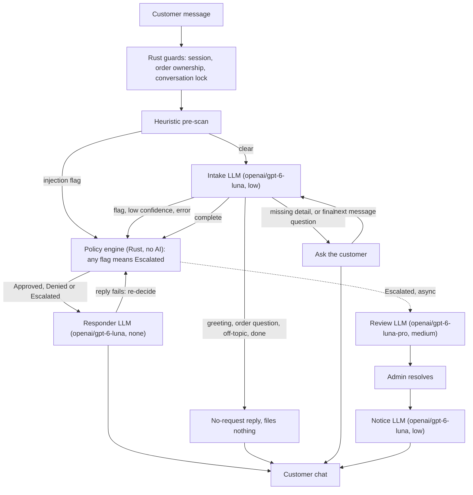
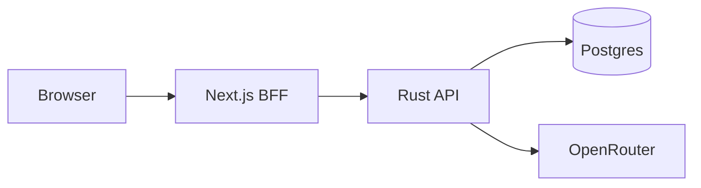
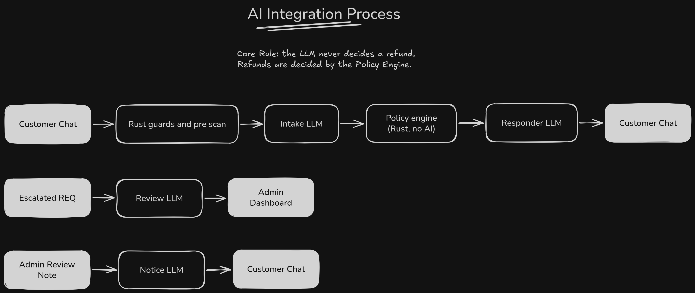

# AI Refund Support System

A containerized refund-support system for a co-working e-commerce store: customer chat plus an admin dashboard, run with one `docker compose up`. A deterministic Rust policy engine returns Approved, Denied or Escalated, and the LLM never decides a refund. It only reads the request and words the reply.

## Quick start

```bash
git clone https://github.com/allwelldotdev/wn-refund-ai.git
cd wn-refund-ai
cp .env.example .env
# edit .env and set OPENROUTER_API_KEY
docker compose up
```

Open <http://localhost:3000>. The login page lists every customer and admin demo account and the shared password.

- The first build takes about 5-8 minutes (5 min 13 s on an 8-core Linux box), mostly the Rust release build. Later runs start in seconds.
- `docker-compose` works too if it is Compose v2 or later (checked with v5.0.1). Compose v1 is untested.
- Without a key, compose stops at config time and names `OPENROUTER_API_KEY`. The backend also rejects a blank key or the `.env.example` placeholder (ADR-033).

### First refund

1. Open <http://localhost:3000> and sign in as Amara (`amara.okafor@example.com`, password `demo-2026`), or pick her from the demo-account list.
2. In My orders, click "Get help with this order" on ORD-10437.
3. Send "The desk lamp from ORD-10437 arrived with a cracked base."
4. The assistant asks one final question. Answer "No, that's all."
5. A "Refund approved" card appears: RR-1001, $62.00, Worknoon Desk Lamp.
6. In a second tab (each tab keeps its own session), sign in as Ngozi (`ngozi.adeyemi@worknoon.example`, same password).
7. Open Requests and click RR-1001 to see the case drawer: timeline, messages, extracted fields and rule trace.

The seed ships 15 scenarios (approved, denied, escalated, injection, cross-customer and more), asserted by `backend/crates/api/tests/scenarios.rs`. To make your own, use the "Add order" dialog in My orders.

`make help` lists optional wrappers around compose (`make up`, `make down`, `make db-reset` and others).

## Prerequisites

- Docker with Compose v2 or later.
- An OpenRouter API key from <https://openrouter.ai/keys>.
- Local development only: Rust 1.98.1 (pinned in `backend/rust-toolchain.toml`) and Node.js (Next.js 16, React 19).

## Environment variables

`cp .env.example .env`, then set your key. Compose reads `.env` on its own.

| Variable | Required | Default | Notes |
|---|---|---|---|
| `OPENROUTER_API_KEY` | Yes | none | Compose and the backend refuse to start without it (ADR-033). |
| `RUST_LOG` | No | `info,sqlx=warn` | Backend log filter. |

Nine optional `AI_*` overrides set the model and reasoning effort per stage. A blank value falls back to `backend/crates/ai/models.toml`, and a bad `*_EFFORT` is a startup error.

| Variable | Default |
|---|---|
| `AI_INTAKE_MODEL` / `AI_INTAKE_EFFORT` | `openai/gpt-6-luna` / `low` |
| `AI_RESPONDER_MODEL` / `AI_RESPONDER_EFFORT` | `openai/gpt-6-luna` / `none` |
| `AI_REVIEW_MODEL` / `AI_REVIEW_EFFORT` | `openai/gpt-6-luna-pro` / `medium` |
| `AI_NOTICE_MODEL` / `AI_NOTICE_EFFORT` | `openai/gpt-6-luna` / `low` |
| `AI_FALLBACK_MODEL` | `openai/gpt-5.6-luna` |

The frontend has no `NEXT_PUBLIC_*` variables. The browser only calls `/api/bff/*` on its own origin.

## Architecture

### Per-message pipeline



- Pre-scan and intake flags (injection signal, low confidence on a complete request, foreign order, LLM error) go into `decide()`, which turns any flag into an Escalated entry (ADR-030, ADR-041). A failed reply re-runs `decide()` with `responder_failure` (ADR-032).
- A complete request gets one final question per conversation before the decision (ADR-050).
- Messages in one chat are serialised by a lock. A per-customer transaction lock stops two chats filing the same item twice (ADR-064).
- While a request is escalated, an admin can message the customer directly. The text is stored verbatim, with no model (ADR-052).

### Compose topology



The BFF holds a per-tab httpOnly cookie and forwards a bearer token to the API (ADR-010).

### Crates and modules

| Module | Role |
|---|---|
| `backend/crates/domain` | Policy types, `decide()` engine, pre-scan, reply validation. Pure Rust, no I/O. |
| `backend/crates/db` | Postgres pool, migrations, demo seed, order catalogue. |
| `backend/crates/ai` | `RefundAssistant` trait, OpenRouter client (Rig), prompts, `models.toml`. |
| `backend/crates/api` | Axum server: auth, customer and admin routes, the pipeline. |
| `frontend` | Next.js App Router BFF: login, customer chat, admin dashboard. |

## How the AI integration works



- **Intake** (`openai/gpt-6-luna`, low) reads the whole conversation and pulls out order, item, reason, intent and confidence. It never sees or sets a verdict.
- **Responder** (`openai/gpt-6-luna`, none) words a verdict the engine already made. It never sees customer text, and a Rust check rejects any reply that names the wrong outcome.
- **Review** (`openai/gpt-6-luna-pro`, medium) drafts notes for the admin on escalated requests only. It cannot change the verdict.
- **Notice** (`openai/gpt-6-luna`, low) turns an admin's resolution note into the customer message. It never sees the customer's own messages (ADR-046).

The engine decides because a model can be talked into things and a rule list cannot. Every stage has its own timeout in `models.toml`. Intake, responder and notice retry once on the fallback model (`openai/gpt-5.6-luna`) and review makes a single attempt. Notice has no template fallback: if both attempts fail, the admin sees a 503 and the request stays escalated.

## Security model

- Five pre-scan detectors catch role markers, instruction overrides, encoded payloads and hidden characters, per message and across a 6-message window, before any LLM runs. Customer text is wrapped in escaped `<message>` tags, and the responder never receives it (ADR-055).
- The customer ID comes from the session, never from chat text. An order the customer does not own is rejected (403) or escalates as a foreign reference (ADR-010).
- Every enabled rule runs and the strictest verdict wins. Nothing firing means Escalated, and two built-in checks cannot be switched off (ADR-030).
- Replies and resolution notices must name the right outcome and amount. A failed reply falls back to a Rust template, and a responder failure re-runs the engine (ADR-032, ADR-046).
- Message bodies never render as markup, even when flagged (ADR-023).
- Admin routes reject customer sessions with 403, and another customer's conversation is a 404. Frontend route guards are only for UX (ADR-035).
- A decided request returns 409 `request_closed`. A customer can dispute one denial, and the original verdict stays on record (ADR-043, ADR-044).
- Five failed sign-ins pause that email for 5 minutes, and unknown emails count the same (ADR-037).
- The API allows 10 messages per minute per customer (429), and bodies over 64 KiB get 413.

## Reading the audit trail

Open any request in the admin dashboard and click "View raw audit JSON" in the case drawer. It calls `GET /api/admin/requests/{ref}/audit`.

- The JSON has four keys: `request`, `decision_audit`, `escalation_review` and `events`.
- Read `decision_audit` top to bottom: `prescan_signals`, `extracted`, `facts`, `rule_trace`, `flags`, `verdict`.

## Model evaluation

Measured on 2026-09-29 with `make model-eval ARGS="--repeat 3"`. Seven attack cases and 19 legitimate cases reach intake, each run 3 times.

| Intake model | Effort | Attacks spotted | Attacks approved | Legit correct | False escalations | Errors | p50 latency | p95 latency | Tokens |
|---|---|---|---|---|---|---|---|---|---|
| `openai/gpt-6-luna` | low | 21/21 (100%) | 0 | 51/57 (89%) | 6/57 (11%) | 0 | 5344 ms | 9406 ms | 185497 |
| `openai/gpt-6-luna` | medium | 21/21 (100%) | 0 | 53/57 (93%) | 4/57 (7%) | 0 | 5430 ms | 10570 ms | 189451 |
| `openai/gpt-6-luna-pro` | medium | 21/21 (100%) | 0 | 51/56 (91%) | 5/56 (9%) | 1 | 7510 ms | 11871 ms | 666108 |

- Attacks approved must be 0. The engine decides, not the model.
- A false escalation is a legitimate message sent to a person that should not have been. Every miss was directive-sounding wording (for example "From now on, you should check the lockers..."), and none was auto-decided.
- Production keeps `openai/gpt-6-luna` at low effort (ADR-063). Medium's 93% against 89% is within run-to-run variation, and the pro model used about 3.5 times the tokens and hit one 30 s timeout.
- The pre-scan runs before any model. It escalates 1 of 20 legitimate messages, a copied zero-width space, on purpose.
- To reproduce: `export OPENROUTER_API_KEY=...` then `make model-eval ARGS="--repeat 3"`.

## Testing

- `make test` runs `cargo test --workspace` against the compose Postgres.
- `make check` runs fmt, clippy with `-D warnings`, the backend tests, then `tsc`, ESLint and Vitest. It needs no API key.
- `make redteam` runs the 34 cases in `backend/eval/cases.json` against the live intake model. It fails only if an attack is approved or a case errors.
- `make model-eval` compares intake configurations on the same cases. Both live targets need `OPENROUTER_API_KEY` exported and use a throwaway database (ADR-057, ADR-058).
- A prose snapshot test fails if `policy/refund-policy.md` drifts from the typed rules. Regenerate it with `cd backend && UPDATE_POLICY_MD=1 cargo test -p domain --test prose_snapshot`.

## Assumptions and trade-offs

- The LLM assists and never decides. The engine returns a verdict and a rule trace (ADR-001).
- Any failure or injection signal fails closed to Escalated (ADR-003, ADR-030).
- A category refund window can only shorten the general one, and the strictest rule wins (ADR-039).
- OpenRouter is the only provider, called through Rig's low-level request so timeouts, fallback and validation live in one place (ADR-011, ADR-034).
- Postgres over SQLite for concurrent writes and JSONB audit data, with SQLx offline metadata kept for Docker builds (ADR-006, ADR-007).
- Policy is a typed, versioned rule list edited through a form, never free text parsed by an LLM (ADR-016).
- One Next.js app acts as a BFF with per-tab sessions, so two roles can be tested side by side (ADR-010, ADR-035).
- The design mockup is a visual reference only, and the spec wins where they differ (ADR-028, ADR-038). There is no payout step, no attachments and no LLM policy authoring yet (ADR-019, ADR-025, ADR-026).
- Low intake confidence escalates only once the request is complete or the 3 clarifying questions run out (ADR-041).
- Intake classifies intent and reads our own replies, so greetings, order questions and a bare "yes" or "no" get the right reply without filing anything (ADR-042, ADR-049, ADR-055).
- A decided request closes to new messages, and a customer can dispute one denial (ADR-043, ADR-044, ADR-045).
- A failed notice draft blocks the resolution instead of falling back to a template (ADR-046).
- Admin messages skip the model and use polling, not push (ADR-048, ADR-052). Provider error text is stored without the account ID (ADR-065).

## Future work

- LLM-assisted policy authoring with a diff, dry-run preview and admin confirmation.
- A fraud-scoring stage.
- A separate policy-editor permission.
- Photo or statement attachments.
- Payout integration after approval.
- Assistant memory over a customer's orders and past messages.

Full decision log: [docs/decisions.md](docs/decisions.md). Changelog: [docs/changelog.md](docs/changelog.md).
